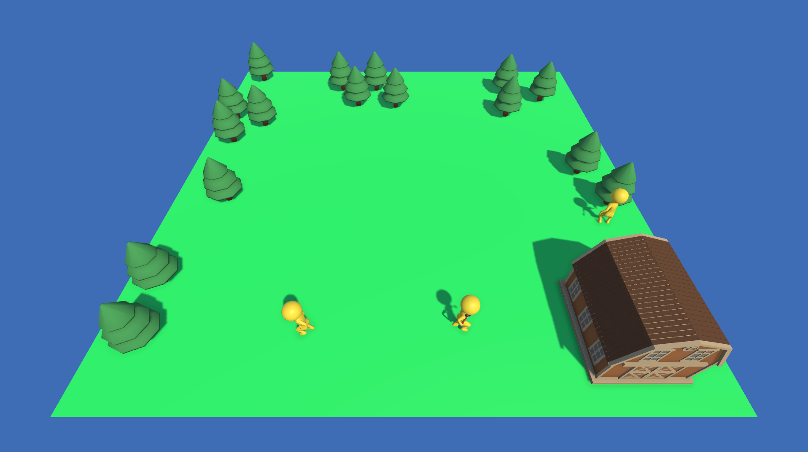

# Behaviour Tree

### Описание
Небольшой проект, демонстрирующий реализацию ИИ с помощью подхода Behaviour Tree. Используются универсальный подход, в котором ИИ разделен на три архитектурных слоя в виде Sensors, Blackboard и Behaviour Tree.

### Скриншоты

